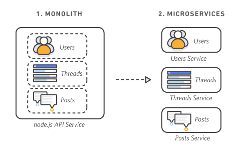

Assignment-6

## Q1: What is Microservice?

- Microservices is a modular apporach designed to address the need for large-scale application development as a group of loosely connected, autonomous services (microservices) interacting through a network.

- In simple words, microservices architecture is a collection of smaller independent units that execute each operation of the application as a separate service. So all of the self-contained services have their own logic & database and perform specific functions as well.

- These micro services talk to each other depending upon the use case. There are seperate projects for an application such as UI, backend, database etc.. Hence, this is know as seperation of concern and single responsibilty principle.

- Advantages of Microservice:
  - Multiple technology Stack
  - Each component and microservice module has its own codebase.
  - Different teams can work on the different process at the same time
  - System deployment for each service will be conducted individually
  - Flexible Scaling
  - Easy Deployment
  - Technological Freedom
  - Reusable Code
  - Resilience

## Q2: What is Monolith architecture?

- Monolithic is a traditional software development approach in which the whole operation of the system is centered as a single, autonomous entity on a single application.

- Earlier web apps were built using Monolith architecture.

- There are various codes such as code for UI, backend, database in a project and suppose if you want to make a small change in the code you need to compile and deploy the whole project. This is monolith architecture.

## Q3: What is the difference between Monolith and Microservice?

- With `monolithic architectures`, all processes are tightly coupled and run as a single service. This means that if one process of the application experiences a spike in demand, the entire architecture must be scaled. Adding or improving a monolithic application’s features becomes more complex as the code base grows. This complexity limits experimentation and makes it difficult to implement new ideas. Monolithic architectures add risk for application availability because many dependent and tightly coupled processes increase the impact of a single process failure.

- With a `microservices architecture`, an application is built as independent components that run each application process as a service. These services communicate via a well-defined interface using lightweight APIs. Services are built for business capabilities and each service performs a single function. Because they are independently run, each service can be updated, deployed, and scaled to meet demand for specific functions of an application.



## Q4: Why do we need a useEffect Hook?

- useEffect hok let's you perform side effects in functional components like data fetching (API) manually changing the DOM or setting up a subscription.

- With useEffect hook we can tell react that after every render call the callback function pass as the first parameter to useEffect.
  ` Syntax - useEffect(()=>{
// code
},[])`

- By default, useEffect runs after every render but we can customize it with the second paramter.As the second parameter, the useEffect accepts an array that allows us to tell react when we want our effect to be called.
  If you want to do something after rendering a component the use useEffect hook.

## Q5: What is optional chaining?

- `Optional Chaining` (`?.`) operator accesses an object's property or calls a function. If the object accessed or function called is `undefined or null` , it returns `undefined` instead of throwing an error.
  `Optional Chaining` (`?.`) is good way of accessing the object keys, it prevents the application from being crashed if the key that we are trying to access is not present. If the key is not present then instead of a throwing key error, it returns `undefined`.

## Q6: What is Shimmer UI?

- A Shimmer UI resembles the page's actual UI, so users will understand how quickly the web or mobile app will load even before the content has shown up. It gives people an idea of what's about to come and what's happening (while UI currently loading) when a page full of content/data takes more than 3 - 5 seconds to load. Shimmer UI is a great way for loading the applications. Instead of showing a loading circle we can design a shimmer UI for our application that is good for user experience.

## Q7: What is the difference between JS expression and JS statement?

- A `JS expression` returns a value that we use in the application. for example:

```
1 + 2 // expresses
"foo".toUpperCase() // expresses 'FOO'
console.log(2) // logs '2'
isTrue ? true : false // returns us a true or false value based on isTrue value
```

A `JS statement`, does not return a value. for example:

```
let x; // variable declaration
if () { } // if condition
```

If we want to use `JS expression` in JSX, we have to wrap in `{/* expression slot */}` and if we want to use `JS statement` in JSX, we have to wrap in `{(/* statement slot */)}`;

## Q8: What is Conditional Rendering? explain with a code example.

- In react we can create multiple components and after that render them depending on some conditions or the state of our application.

- In other words, based on one/several conditions a component decided which element it returns.

- In react conditional rendering works the same way as condition works in javascript.

- eg: If user is logged in the display Welcome user else display welcome guest.

- 4 different approaches:

  ```a] using if-else:
  isLoggedIn = true;
  if(isLoggedIn){
  return <div>Welcome User</div>
  }else{
  return <div>Welcome Guest</div>
  }
  ```

```
b] using element variable:
isLoggedIn = true;
if(isLoggedIn){
message = Welcome User
}else{
message = Welcome Guest
}
return <div> {message} </div>
```

```
c] using ternary operator:
isLoggedIn = true;
isLoggedIn? <div>Welcome User</div> : <div>Welcome Guest</div>
```

````
d] short circuit operator:
isLoggedIn = true;
isLoggedIn && <div>Welcome User</div>```

````

## Q9: What is `CORS`?

- Cross-Origin Resource Sharing (CORS) is an HTTP-header based mechanism that allows a server to indicate any origins (domain, scheme, or port) other than its own from which a browser should permit loading resources.
  CORS defines a way in which a browser and server can interact to determine whether it is safe to allow the cross-origin request.

## Q10: What is `async and await`?

- `Async`: It simply allows us to write promises-based code as if it was synchronous and it checks that we are not breaking the execution thread. It operates asynchronously via the event loop. Async functions will always return a promise. It makes sure that a promise is returned and if it is not returned then JavaScript automatically wraps it in a promise which is resolved with its value.
  `Await`: Await function is used to wait for the promise. It could be used within the `async` block only. It makes the code wait until the promise returns a result. It only makes the async block wait.
  for example:

```
// async function getRestaurant to fetch Swiggy API data
  async function getRestaurants() {
    const data = await fetch(
      "Swiggy_API_URL"
    );
    const json = await data.json();
    // we get the Swiggy API data in json format
    console.log(json);
  }
```

## Q11: What is the use of `const json = await data.json()`; in `getRestaurants()`?

- The `data` object, returned by the `await fetch()`, is a generic placeholder for multiple data formats.
  so we can extract the `JSON object` from a `fetch` response by using `await data.json()`.
  `data.json()` is a method on the data object that lets you extract a `JSON object` from the data or response. The method returns a promise because we have used `await` keyword.
  so `data.json()` returns a promise resolved to a `JSON object`.
