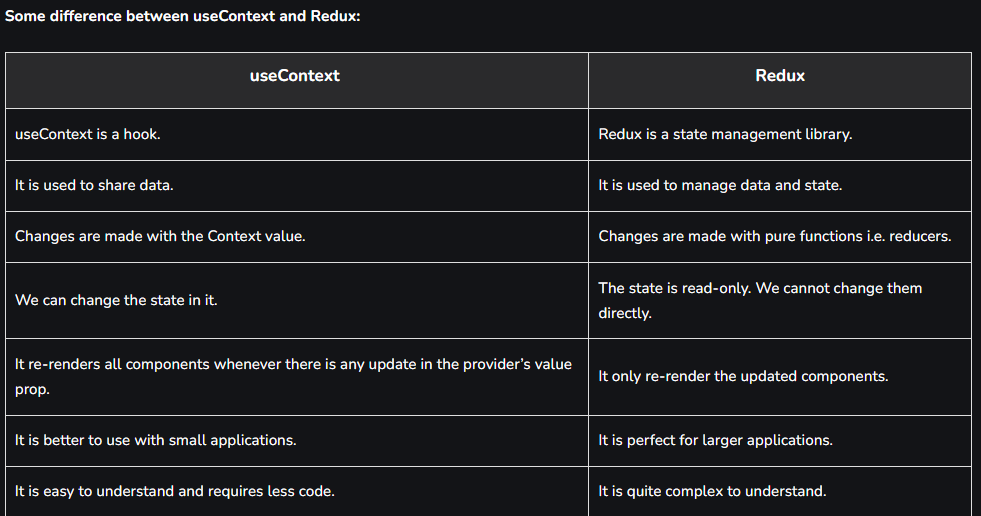

Assignment-12

## Q1: useContext vs Redux?



## Q2: Advantages of using Redux Toolkit over Redux?

A: Reason for using Redux toolkit:

1. A lot lesser boilerplate code is required compared to Redux.

2. Redux hooks like `useSelector` and `useDispatch` make things so short and easy to use. [This is not specific to Redux toolkit, however, highlighting it here as it is extremely helpful to consume these hooks in functional component and might be helpful for those who are completely new to redux]

3. You don't need to do manual `thunk` setup as redux-toolkit comes with out of the box `createAsyncThunk` which enables you to perform async operations in very hassle free way.

4. `getState` is also very helpful in obtaining state variables across any of your actions or async operations.

5. Mutability might be considered as advantage or disadvantage, but if you're not too used to writing with spread operators, you might love this feature as well. Do straight assignments and let redux toolkit take care of mutability under the hoods.

6. `current` can be used to log your state anywhere in case you want to debug and understand where things are going wrong. (Of course, Redux debugger tools are great as well)

7. Prebuilt templates: you might want to use `npx create-react-app my-app --template redux-typescript` or if you're using it with next: `yarn create next-app --example with-redux with-redux-app`. It gives you a setup ready `redux toolkit` boiler plate and also contains a boiler plate of most important redux state management applications so that you could refer them to create your own slices very easily.

## Q3: Explain Dispatcher.

A: Dispatching actions in Redux is the fundamental method of updating a Redux store's state . Actions are used to store relevant information for the state , and they reach the store through the dispatch() method available on the store object. You can use either store.

- Dispatch is used to send actions into our redux store and is the only way we can affect the store from within a component.

## Q4: Explain Reducer.

A: A reducer is a function that is able to process our message, our Action. A reducer takes the existing state and applies the message on it. The end result is a updated state in RTK.

- Reducers always return the accumulation of the state (based on all previous and current actions). Therefore, they act as a reducer of state. Each time a Redux reducer is called, the state and action are passed as parameters.

## Q5: Explain Slice.

A: Slice - A function that accepts an initial state, an object of reducer functions, and a "slice name", and automatically generates action creators and action types that correspond to the reducers and state. This API is the standard approach for writing Redux logic.

- A "slice" is a collection of Redux reducer logic and actions for a single feature in your app, typically defined together in a single file. The name comes from splitting up the root Redux state object into multiple "slices" of state.

## Q6: Explain Selector.

A: A "selector function" is any function that accepts the Redux store state (or part of the state) as an argument, and returns data that is based on that state. A selector function can have any name you want.

- The useSelector hook takes a selector function to select data from the store and another function equalityFn to compare them before returning the results and determine when to render if the data from the previous and current state are different. It's equivalent to mapStateToProps in connect.

- selector are used for `subscribing` to the store.

## Q7: Explain createSlice and the configuration it takes.

A: A function that accepts an initial state, an object of reducer functions, and a "slice name", and automatically generates action creators and action types that correspond to the reducers and state. This API is the standard approach for writing Redux logic.

configuration it requried are-

1. object which contains
   - slice name.
   - initial State.
   - reducers object

```
import { createSlice, current } from "@reduxjs/toolkit";

const cartSlice = createSlice({
  name: "cartSlice",
  initialState: {
    items: [],
  },
  reducers: {
    addItem: (state, action) => {
      state.items.push(action.payload);
    },
    removeItem: (state) => {
      state.items.pop();
    },
    clearCart: (state, action) => {

      return { items: [] };
    },
  },
});

export const { addItem, removeItem, clearCart } = cartSlice.actions;
export default cartSlice.reducer;

```
